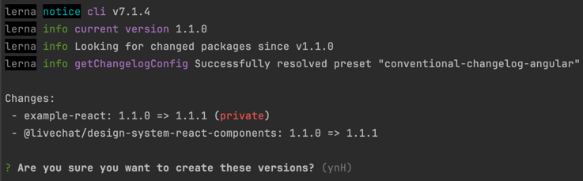

# Release process of `design-system`

## Releasing package to `npm` registry

To deploy a package to the `npm` you need to be logged in as a `LiveChat` organization member. To confirm that you are logged in, you can use `npm whoami`. If you are not, use `npm login` and follow the instructions.

The deployment process consists of only single command: `npm run deploy`. It will execute several sub-commands and you can run them separately if you wish, namely:

- `predeploy` - execute predeploy script
  - `check` - fire up linter and unit tests that are provided per package
  - `prettier` - format the code across the packages
  - `build` - build the packages
- `lerna version` - create a new version of the packages based on the conventional commits
- `lerna publish` - publish the packages to `npm` registry

During the build phase,
Lerna will ask you to confirm the version of the packages which Lerna chooses based on the conventional commits.
You will need to confirm the version if everything is correct.

### Disclamer

Keep in mind that a package won't be versioned if it has not changed. In the future a changed package will catch up with other packages in versioning. For example, assuming that version of package `react-components` is `1.1.3` but `icons` lag behind a bit and are at `1.1.0` because no changes has been made since two deploys. If you make some changes in `react-components` and in `icons` both packages will get `1.1.4` version.

If you want to force versioning of a package you can use `--force-publish` flag with `lerna version` command instead of our `deploy` script. This will force Lerna to always version all packages, regardless of if they have changed since the previous release. Then they will all be published to the registry by `lerna publish from-git`.

## Updating documentation

On `Github` add the release with correct version and change-log.

- Tag is added automatically by [lerna](https://github.com/lerna/lerna), remember to target `main` branch.
- The name of the release is the name of the version/tag (eg. `v1.1.0`)
- First paragraph title can be set to `What's Changed`.
- In the change-log mention packages changed, link the pull requests and respective issues that are part of a release. Please follow the style used for previous releases (including author, PR, issue, and title info).
  Example of correctly filled release note:
  
